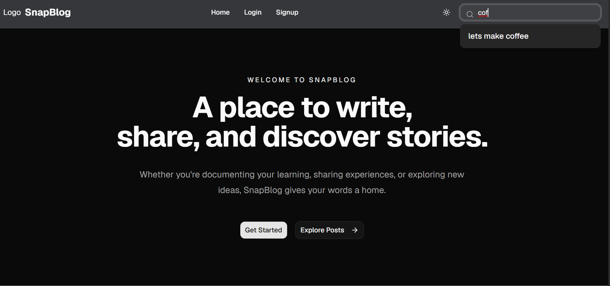
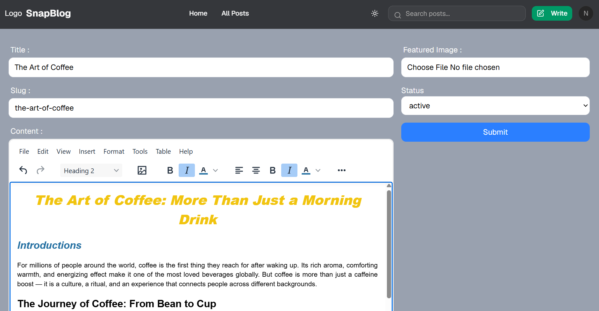

# 📝 NoteVerse

NoteVerse is a modern full-stack blogging platform built with **React, Redux Toolkit, Appwrite, and Tailwind CSS**. It provides a complete blogging experience where users can securely create, edit, manage, and explore blog posts through a fast, responsive, and production-ready interface.

The application follows modern React development practices with optimized data fetching, caching, error monitoring, performance improvements, and scalable component architecture.

---

- Landing Page


- Rich Text Editor for Blogs
#  Features

##  Authentication & Authorization
- User signup and login using Appwrite Authentication
- Persistent authentication sessions
- Protected routes for authenticated users
- Secure logout functionality
- User-specific content management

---

##  Blogs
- Create, edit, and delete blog posts
- View individual blog details
- Manage personal posts through user profiles
- Automatic slug generation for SEO-friendly URLs
- Rich text content creation using TinyMCE editor

---

##  Media Management
- Upload blog images using Appwrite Storage
- Dynamic image rendering
- Optimized image loading with lazy loading

---

##  User Profiles
- Dedicated user profile pages
- Display user information and created posts
- Personalized blogging experience

---

##  Modern UI & UX
- Responsive design 
- Dark mode support using Context API
- Theme persistence using localStorage
- Toast notifications for user feedback
- Skeleton loading states for improved experience
- Custom error handling UI

---

#  Performance Optimizations

- React.lazy for component-level lazy loading
- Suspense for optimized rendering
- Route-based code splitting
- Image lazy loading
- Bundle optimization
- Lighthouse performance improvements

---

#  Data Fetching & State Management

- Redux Toolkit for global application state
- TanStack Query for server-state management
- Query caching and efficient data synchronization
- Optimistic mutations for faster user interactions
- Automatic query invalidation after updates

---

#  Reliability & Monitoring

- Custom React Error Boundaries
- Production error tracking using Sentry
- Improved application stability

---

#  Tech Stack

## Frontend
- React.js
- Redux Toolkit
- React Router DOM
- React Hook Form
- Tailwind CSS
- TinyMCE Rich Text Editor
- Context API

## Data & State Management
- TanStack Query
- Redux Toolkit

## Backend & Services
- Appwrite
  - Authentication
  - Database
  - Storage

## Monitoring
- Sentry

## Deployment & Tools
- Vercel
- Vite

---

# 📂 Project Architecture

```
src
│
├── app
│   └── store.js
│
├── components
│   ├── Header
│   ├── Footer
│   ├── Container
│   ├── Button
│   ├── Input
│   ├── Select
│   └── PostCard
│
├── pages
│   ├── Home
│   ├── Login
│   ├── Signup
│   ├── Profile
│   ├── AddPost
│   ├── EditPost
│   └── Post
│
├── services
│   └── Appwrite services
│
├── store
│   └── authSlice
│
├── context
│   └── ThemeContext
│
└── main.jsx
```

---

# ⚙️ Getting Started

## Clone the repository

```bash
git clone https://github.com/saniashinde28/NoteVerse.git
```

## Install dependencies

```bash
npm install
```

## Create Environment Variables

Create a `.env` file in the project root:

```env
VITE_APPWRITE_URL=
VITE_APPWRITE_PROJECT_ID=
VITE_APPWRITE_DATABASE_ID=
VITE_APPWRITE_COLLECTION_ID=
VITE_APPWRITE_BUCKET_ID=
```

## Start Development Server

```bash
npm run dev
```

## Build For Production

```bash
npm run build
```

---
# 🌐 Deployment

The application is deployed using **Vercel**.

https://note-verse-blogs.vercel.app/

---
## License

This project is licensed under the MIT License.

## Author

**Sania Shinde**

GitHub: https://github.com/saniashinde28

---

**Note:** This project is currently **under active development**. New features, UI improvements, and enhancements are being added continuously.
